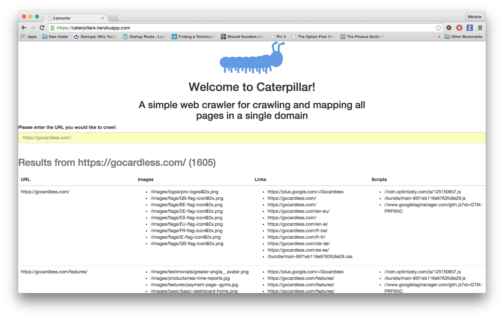

# Introduction to caterpillar
Caterpillar is a simple web crawler that performs the following activities:
1. Crawls all pages within a single domain
2. Creates a site map, showing which static assets each page depends on

## Technologies used
Node.js, Express, Bluebird (Promise library), Cheerio (DOM parser, alternative to JS-DOM) Backbone.js, Marionette.js, Heroku

## Instructions for running caterpillar
1. run bower install and npm install to make sure you have the required dependencies

## Design Decisions and Challenges
1. A big design decision for this web crawler was NOT to use PhantomJS on the client-side for parsing. 
  - An advantage to PhantomJS is the robustness of results - using Phantom would have enabled me to get static assets listed in the CSS and JS files, as well as all of the assets declared in the HTML pages. 
  - However, this robustness would likely have been offset by being less performant. Blogs I read stated that average time to crawl one webpage could be >1 second, as PhantomJS rebuilds the DOM each time it crawls a webpage. Instead, Cheerio does not concern itself with completely rebuilding the page. 

2. Sending data in chunks back to the client was a challenging issue. Chrome and Firefox handled sending chunks from the server differently: Chrome often batched its chunks for sending, while Firefox performed as expected (sent one chunk per response.write() call). This resulted in a workaround as follows: 
  - On the server side, I used built-in Node.js functionality: response.write(chunk). The chunk that was sent over was a stringified function call of processChunk, which is defined in a script tag in the index.html file. processChunk handles the stringified siteMap entry (which includes the url, images, scripts, and links), and adds it to the Backbone Collection app.siteMap.
  - On the client side, I used xhr event handling for the "onreadystatechange" event. This event is triggered each time the server sends some information to the client. I called eval() on the stringified function sent from the server. In certain cases, eval() is dangerous, because the user may enter malicious Javascript code; however, this use of eval() has a high likelihood of being safe - the server is sending specific responses back, and those are the only function calls run by eval().

3. Running a variable number of asynchronous recursive calls to appController.crawlPages()
  - I needed to use Promise.reduce() as seen on line 59 in appController.js to call crawlPages on each pageLink in order, one after the other. Each invocation of crawlPages depended upon having an updated siteMap to check (to see if a pageLink had already been crawled). Running multiple crawlPages() at the same time caused synchroncity issues.  

4. Server automatically timed out after 2 minutes
  - This was a problem when sites took longer than 2 minutes to parse completely. For about 300 pages, the time to parse is around 2.5 minutes. 
  - To deal with this problem, I kept the server connection open in index.js

